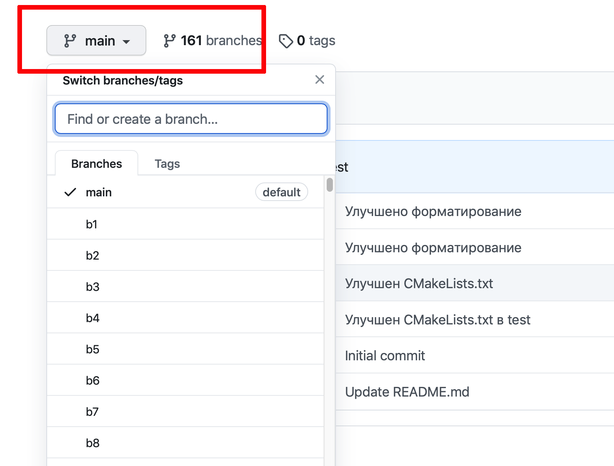
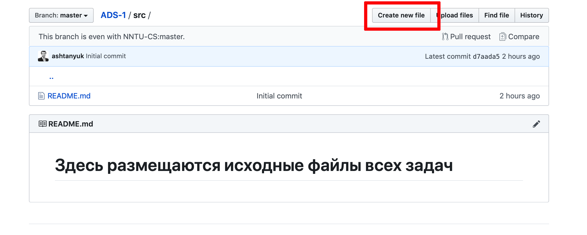

# Инструкция о выполнении заданий на сайте **GitHub**

Для начала работы необходимо создать бесплатный аккаунт на сайте **github.com**.

## Алгоритм выполнения практической работы

- После входа в систему (*Sign in*) переходим на страницу организации *https://github.com/NNTU-CS*

- Выбираем репозиторий с практическим заданием (в примере **ADS-0**)

- Нажимаем кнопку **Fork** в правом верхнем углу окна
- Начинается процесс копирования репозитория в аккаунт пользователя

- После окончания копирования мы возвращаемся в свой аккаунт (вместо **ashtanyuk** будет ваше имя пользователя)

- в выпадающем списке выбираем свою **индивидуальную** ветку (в примере **b160**)

- Переходим в каталог **src**

- Выбираем в списке имя файла **alg.cpp**

- входим в режим редактирования файла

- вставляем реализацию алгоритма в тело функции

- Нажимаем внизу на зеленую кнопку **Commit**

- Нажимаем справа на надпись **Pull Request**

- убеждаемся, что номера веток слева и справа совпадают

- Нажимаем  на зеленую кнопку **Create pull request**

Далее, в целевом репозитории создается очередь из пул-запросов на проверку. Для каждого запроса выполняется автоматическая процедура построения программы и тестирования. Успешное окончание тестирования сопровождается зеленой галочкой, неуспешное - красным крестиком. Работа засчитывается, если она успешно прошла тестирование.

- посмотреть список пул-запросов, отправленных на проверку можно в меню **Pull requests**
- посмотреть результаты проверки своего пул-запроса можно в меню **Actions**

- чтобы посмотреть ошибки, нужно зайти в **Actions**

- далее, выбираем пункт с ошибкой

- разкрываем лог и находим описание ошибки

- для того, чтобы устранить ошибку, нужно в своем аккаунте исправить файл **alg.cpp**, пул-запрос обновится автоматически

# Список участников (веток)

|№	|ФИО|	Группа	|Ветка|
|---|---|--------|-----|
|1 |  АджуджЮнис                | 20-ИСТ-1 | b1 |
|2 |  Акимкин Алексей           | 20-ИСТ-1 | b2 |
|3 |  Бабочкина Полина          | 20-ИСТ-1 | b3 |
|4 |  Барруш Жилсон Де Ассунсау. | 20-ИСТ-1 | b4 |
|5 |  Беляева Полина            |  20-ИСТ-1 | b5 |
|6 |  Вайнбаум Денис            | 20-ИСТ-1 | b6 |
|7 |  Валтухова Виктория        | 20-ИСТ-1 | b7 |
|8 |  Вдовин Иван               | 20-ИСТ-1 | b8 |
|9 |  Гусейнов Ибрагим          | 20-ИСТ-1 | b9 |
|10|  Жорновая Анна             | 20-ИСТ-1 | b10 |
|11|  Заплатин Александр        | 20-ИСТ-1 | b11 |
|12|  Зарубин Денис             | 20-ИСТ-1 | b12 |
|13|  Исаев Максим| 20-ИСТ-1 | b13 |
|14|  КапитаПедруБенилдуЛанду| 20-ИСТ-1 | b14 |
|15|  Кирсанов Роман| 20-ИСТ-1 | b15 |
|16|  Кобец Анна| 20-ИСТ-1 | b16 |
|17|  Лисин Сергей| 20-ИСТ-1 | b17 |
|18|  Литвинов Александр| 20-ИСТ-1 | b18 |
|19|  Макарова Алина| 20-ИСТ-1 | b19 |
|20|  Мартынова Ирина| 20-ИСТ-1 | b20 |
|21|  Мокерова Елена| 20-ИСТ-1 | b21 |
|22|  Овчаренко Екатерина| 20-ИСТ-1 | b22 |
|23|  Романчева Дарья| 20-ИСТ-1 | b23 |
|24|  Румянцева Кира| 20-ИСТ-1 | b24 |
|25|  Рындов Сергей| 20-ИСТ-1 | b25 |
|26|  Саватеев Андрей| 20-ИСТ-1 | b26 |
|27|  Соловьев Максим| 20-ИСТ-1 | b27 |
|28|  Софонов Роман| 20-ИСТ-1 | b28 |
|29|  Токарев Максим| 20-ИСТ-1 | b29 |
|30|  Толстобров Дмитрий| 20-ИСТ-1 | b30 |
|31|  Тэш Артур| 20-ИСТ-1 | b31 |
|32|  Филатова Марина| 20-ИСТ-1 | b32 |
|33|  Фокина Мария| 20-ИСТ-1 | b33 |
|34|  Хмельников Роман| 20-ИСТ-1 | b34 |
|35|  Чернеева Валерия| 20-ИСТ-1 | b35 |
|36|  Шамина Татьяна| 20-ИСТ-1 | b36 |
|37|  Шевелин Михаил| 20-ИСТ-1 | b37 |
|38|  Шпанеров Денис| 20-ИСТ-1 | b38 |
|39| Алонцев Артемий | 20-ИСТ-2 | b39 |
|40| Бабасян Гамлет | 20-ИСТ-2 | b40 |
|41| Бартиев Артур  | 20-ИСТ-2 | b41 |
|42| Бартов Дмитрий | 20-ИСТ-2 | b42 |
|43| Безлепкина Калерия | 20-ИСТ-2 | b43 |
|44| Борисов Михаил | 20-ИСТ-2 | b44 |
|45| Ванчинов Даниил | 20-ИСТ-2 | b45 |
|46| Васильев Дмитрий | 20-ИСТ-2 | b46 |
|47| Вялова Александра | 20-ИСТ-2 | b47 |
|48| Гамал Мухаммед| 20-ИСТ-2 | b48 |
|49| Голованов Данил | 20-ИСТ-2 | b49 |
|50| Голубев Даниил | 20-ИСТ-2 | b50 |
|51| Гулин Дмитрий | 20-ИСТ-2 | b51 |
|52| Гуренко Никита | 20-ИСТ-2 | b52 |
|53| Захаров Максим | 20-ИСТ-2 | b53|
|54| Зубанов Дмитрий | 20-ИСТ-2 | b54 |
|55| Козлов Роман | 20-ИСТ-2 | b55|
|56| Коновалова Ирина | 20-ИСТ-2 | b56 |
|57| Красильников Александр | 20-ИСТ-2 | b57 |
|58| Крюков Кирилл | 20-ИСТ-2 | b58 |
|59| Кудашов Андрей | 20-ИСТ-2 | b59 |
|60| Кутузова Виктория | 20-ИСТ-2 | b60 |
|61| Левина Дарья | 20-ИСТ-2 | b61 |
|62| Ледящев Роман | 20-ИСТ-2 | b62 |
|63| Мануэль МарсиуСелениу Де Фрейташ| 20-ИСТ-2 | b63 |
|64| Мигунов Михаил | 20-ИСТ-2 | b64 |
|65| Мокрушов Антон | 20-ИСТ-2 | b65 |
|66| Мудров Артём | 20-ИСТ-2 | b66 |
|67| Мурашкин Роман | 20-ИСТ-2 | b67 |
|68| Нагорная Яна | 20-ИСТ-2 | b68 |
|69| Обухов Сергей | 20-ИСТ-2 | b69 |
|70| Смирнов Николай | 20-ИСТ-2 | b70 |
|71| Усачева Алина | 20-ИСТ-2 | b71 |
|72| Утина Екатерина | 20-ИСТ-2 | b72 |
|73| Чернавин Данила | 20-ИСТ-2 | b73 |
|74| Черненко Илья | 20-ИСТ-2 | b74 |
|75| Чипижко Дмитрий | 20-ИСТ-2 | b75 |
|76| Чуплыгин Артем | 20-ИСТ-2 | b76 |
|77| Шеин Андрей | 20-ИСТ-2 | b77 |
|78| Акимкин Роман | 20-ИСТ-3 | b78 |
|79| Бахвалов Александр | 20-ИСТ-3 | b79 |
|80| Белова Алена | 20-ИСТ-3 | b80 |
|81| Алтыбаев Гафур | 20-ИСТ-3 | b81 |
|82| Войнов Никита | 20-ИСТ-3 | b82 |
|83| Волосников Даниил | 20-ИСТ-3 | b83 |
|84| Галанин Дмитрий | 20-ИСТ-3 | b84 |
|85| Данилов Евгений | 20-ИСТ-3 | b85 |
|86| Ежов Антон | 20-ИСТ-3 | b86 |
|87| Елесин Николай | 20-ИСТ-3 | b87 |
|88| Еремин Алексей | 20-ИСТ-3 | b88 |
|89| Зарудаев Владислав | 20-ИСТ-3 | b89 |
|90| Засядько Аркадий  | 20-ИСТ-3 | b90 |
|91| Замятин Роман| 20-ИСТ-3 | b91 |
|92| Ибрахим Мостафа Кадри | 20-ИСТ-3 | b92 |
|93| Иванчуков Арсений| 20-ИСТ-3 | b93 |
|94| Ивашкин Алексей| 20-ИСТ-3 | b94 |
|95| Камбулов Андрей| 20-ИСТ-3 | b95 |
|96| Квашнина Екатерина| 20-ИСТ-3 | b96 |
|97| Корнев Владимир| 20-ИСТ-3 | b97 |
|98| Краснов Антон| 20-ИСТ-3 | b98 |
|99| Крутько Любовь| 20-ИСТ-3 | b99 |
|100| Кубышев Иван | 20-ИСТ-3 | b100 |
|101| Макеев Владимир | 20-ИСТ-3 | b101 |
|102| Малышева Анастасия| 20-ИСТ-3 | b102 |
|103| Маруф Али| 20-ИСТ-3 | b103 |
|104| Мохамед Харун Тарек..| 20-ИСТ-3 | b104 |
|105| Муса Зайн Альабедейн| 20-ИСТ-3 | b105 |
|106| Панфилов Максим| 20-ИСТ-3 | b106 |
|107| Повалихин Андрей| 20-ИСТ-3 | b107 |
|108| Санников Кирилл| 20-ИСТ-3 | b108 |
|109| Телина Ксения| 20-ИСТ-3 | b109 |
|110| Тесёлкин Михаил| 20-ИСТ-3 | b110 |
|111| Ткачев Дмитрий| 20-ИСТ-3 | b111 |
|112| Товарнов Александр| 20-ИСТ-3 | b112 |
|113| Филимонов Даниил| 20-ИСТ-3 | b113 |
|114| Фроловская Анна| 20-ИСТ-3 | b114 |
|115| Цибиков Алексей| 20-ИСТ-3 | b115 |
|116| Ба Риан Риан Салем Абдулла | 20-ИСТ-4 | b116 |
|117| Бажин Евгений | 20-ИСТ-4 | b117 |
|118| Блохин Артем | 20-ИСТ-4 | b118 |
|119| Бочкарева Дарья | 20-ИСТ-4 | b119 |
|120| Волгина Дарья | 20-ИСТ-4 | b120 |
|121| Воронина Ирина | 20-ИСТ-4 | b121 |
|122| Глухов Кирилл | 20-ИСТ-4 | b122 |
|123| Замарий Данил | 20-ИСТ-4 | b123 |
|124| Иванова Мария | 20-ИСТ-4 | b124 |
|125| Кабанова Анастасия | 20-ИСТ-4 | b125 |
|126| Карова Анастасия | 20-ИСТ-4 | b126 |
|127| Киван Омар Ибрахим Абдельхафиз | 20-ИСТ-4 | b127 |
|128| Кокурин Никита  | 20-ИСТ-4 | b128 |
|129| Коновалова Мария | 20-ИСТ-4 | b129 |
|130| Кудрявцев Антон | 20-ИСТ-4 | b130 |
|131| Кузнецова Лидия | 20-ИСТ-4 | b131 |
|132| Локтионова Полина | 20-ИСТ-4 | b132 |
|133| Моисеев Даниил | 20-ИСТ-4 | b133 |
|134| Морозова Арина | 20-ИСТ-4 | b134 |
|135| Мустафа Сулиман Абделла Ахмед| 20-ИСТ-4 | b135 |
|136| Непомнящая Яна | 20-ИСТ-4 | b136 |
|137| Новиков Андрей | 20-ИСТ-4 | b137 |
|138| Огаркова Валентина | 20-ИСТ-4 | b138 |
|139| Палачев Максим | 20-ИСТ-4 | b139 |
|140| Платова Екатерина | 20-ИСТ-4 | b140 |
|141| Плесовских Полина | 20-ИСТ-4 | b141 |
|142| Послов Алексей | 20-ИСТ-4 | b142 |
|143| Рукавишникова Арина | 20-ИСТ-4 | b143 |
|144| Сантос Мигель Барбоса Дос| 20-ИСТ-4 | b144 |
|145| Силва Ледислау Себаштиау Да| 20-ИСТ-4 | b145 |
|146| Смирнова Екатерина | 20-ИСТ-4 | b146 |
|147| Степанов Ярослав | 20-ИСТ-4 | b147 |
|148| Титова Елизавета | 20-ИСТ-4 | b148 |
|149| Торопов Константин | 20-ИСТ-4 | b149 |
|150| Федотов Илья | 20-ИСТ-4 | b150 |
|151| Хохлова Наталья | 20-ИСТ-4 | b151 |
|152| Цыбышев Артем | 20-ИСТ-4 | b152 |
|153| Чебуранов Матвей | 20-ИСТ-4 | b153 |
|154| Черняйкина Елизавета | 20-ИСТ-4 | b154 |
|155| Шарандова Ольга | 20-ИСТ-4 | b155 |
|156| Шарова Анна | 20-ИСТ-4 | b156 |
|157| Эзбербегов Али Эзерович| 20-ИСТ-4 | b157 |
