# Инструкция о выполнении заданий на сайте **GitHub**

Для начала работы необходимо создать бесплатный аккаунт на сайте **github.com**.

## Предварительные замечания

В рамках курса "Алгоритмы и структуры данных" вам необходимо выполнить 10 практических заданий. Каждое задание находится в отдельном репозитории GitHub, доступ к которым открывается в соотвествующее время. Названия репозиториев *ADS-1*, *ADS-2*, ..., *ADS-10*. Репозиторий *ADS-0* открыт всегда и служит для тренировки.

Все репозитории расположены на странице организации по адресу **https://github.com/NNTU-CS**.

У каждого репозитория, помимо времени открытия есть также *deadline*, после которого отправка решения возможна, но оценка будет снижена по результатам проверки. Внимательно следите за датой очередного дедлайна, сведения будут доступны на странице курса или в начале сраницы с описанием задания.

В каждом репозиторием с заданием есть страница (README) с описанием задачи, а также структура файлов/каталогов. Читать описание задачи нужно внимательно, а если возникнут вопросы, то немедленно обратиться к преподавателю за разъяснением.

Решение задач производится на языке программирования С++ с соблюдение правил оформления исходного кода в соответствии с **https://google.github.io/styleguide/cppguide.html**. Русскоязычная версия: **https://habr.com/ru/post/480422/**

После решения задачи и получения работоспособного кода его нужно скопировать с соответсвующее место репозитория (читаем внимательно описание) и создать **пул-запрос** на проверку.

Проверка проходит в 2 этапа: проверка оформления исходного кода и проверка самого кода. На втором шаге происходит попытка построить программу и выполнить тесты для проверки работоспособности.

## Практические советы по выполнению заданий

- Несмотря на то, что задания общие для всех, не следует списывать решения друг у друга. Предусмотрена проверка решений на плагиат со снижением итоговой оценки. Ну и при списывании теряется смысл всего обучения.
- Внимательно читаем сообщения об ошибках в log-файлах процедур проверки. Не стоит исправлять ошибки по одной и снова выполнять проверку, лучше действовать, накопив значительное число исправлений.
- Работать и присылать решения только в рамках своей индивидуальной ветки. При направлении пул-запроса в main-ветку, оценка снижается.

## Алгоритм выполнения практической работы

- После входа в систему (*Sign in*) переходим на страницу организации *https://github.com/NNTU-CS*

- Выбираем репозиторий с практическим заданием (в примере **ADS-0**)

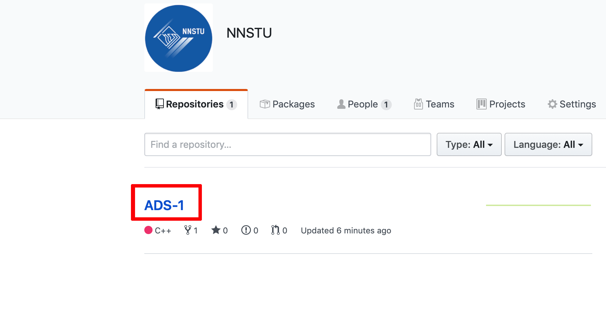

- Нажимаем кнопку **Fork** в правом верхнем углу окна
- Начинается процесс копирования репозитория в аккаунт пользователя

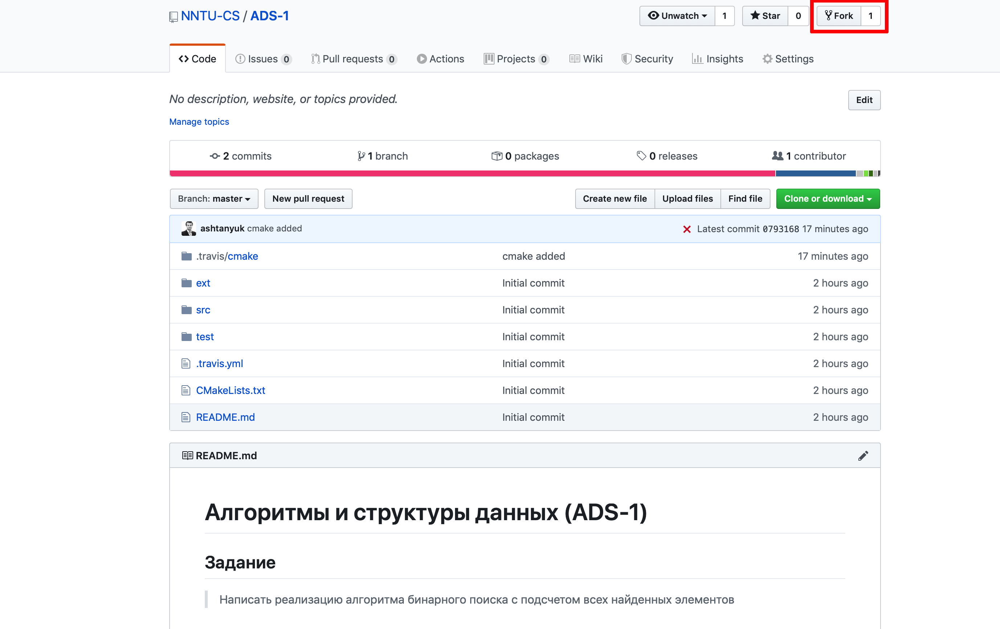

- В процессе копирования нужно оставить поле включенным (в таком случае скопируется только содержимое главной ветки с заданием)

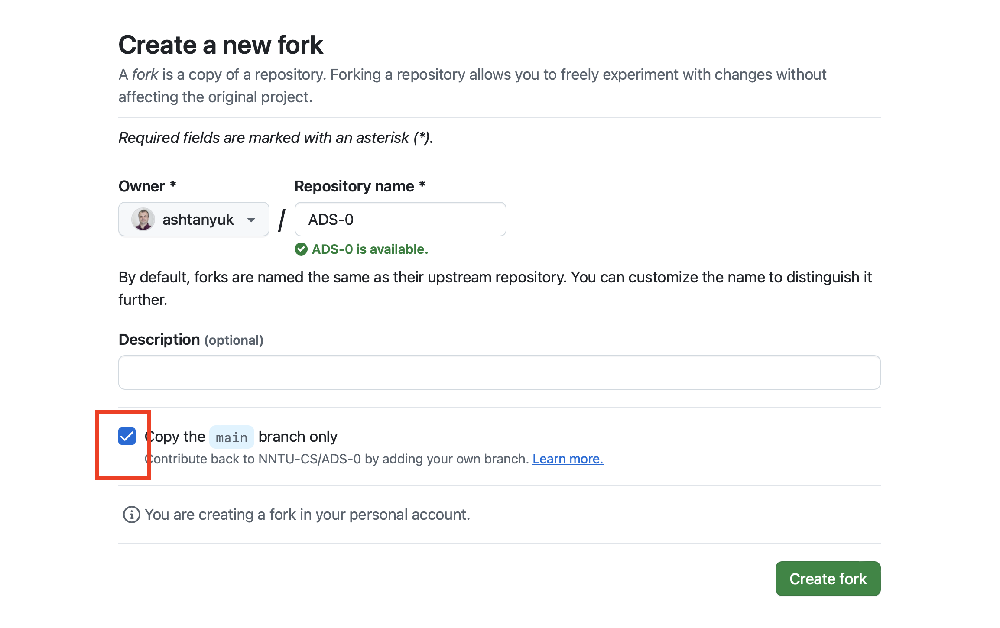

- После окончания копирования мы возвращаемся в свой аккаунт (вместо **ashtanyuk** будет ваше имя пользователя)

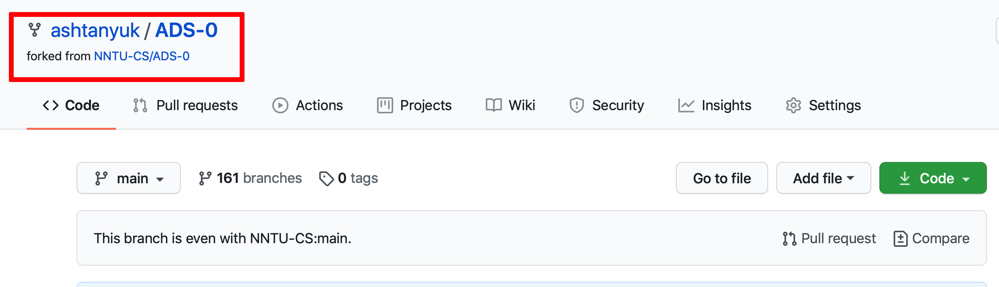

- Переходим в каталог **src**

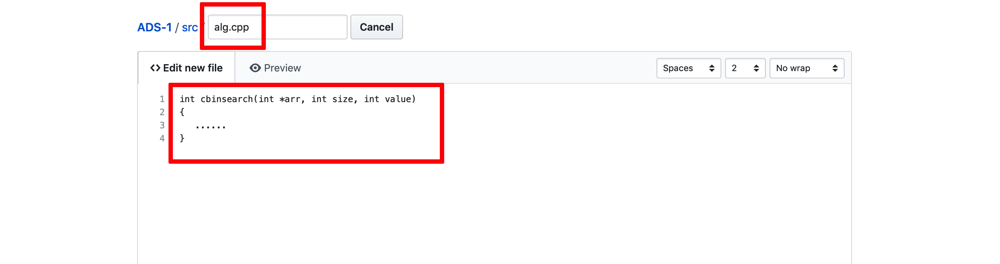

- Выбираем в списке имя файла **alg.cpp**

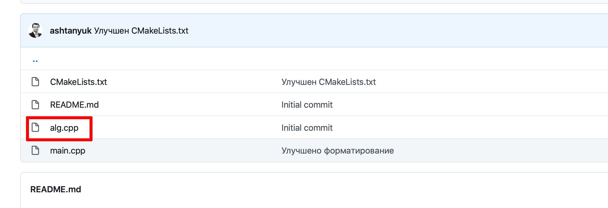

- входим в режим редактирования файла

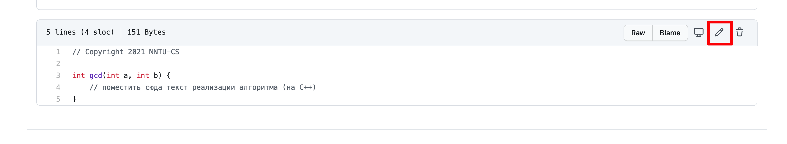

- вставляем реализацию алгоритма в тело функции

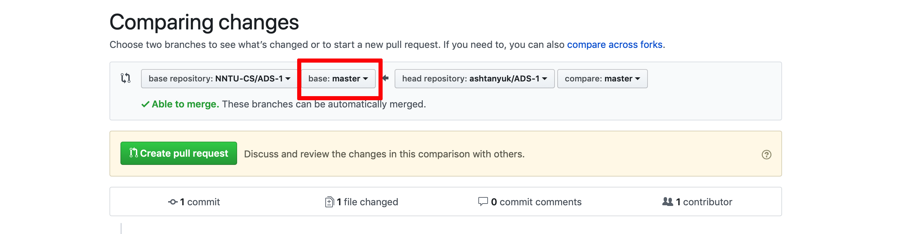

- Нажимаем внизу на зеленую кнопку **Commit**

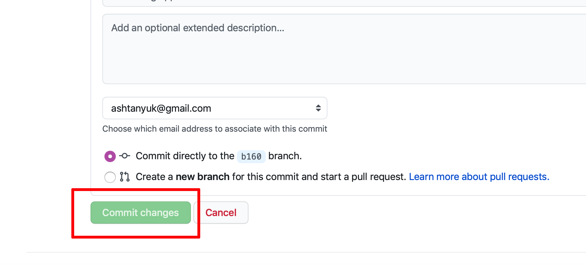

- Нажимаем справа на надпись **Contribute**

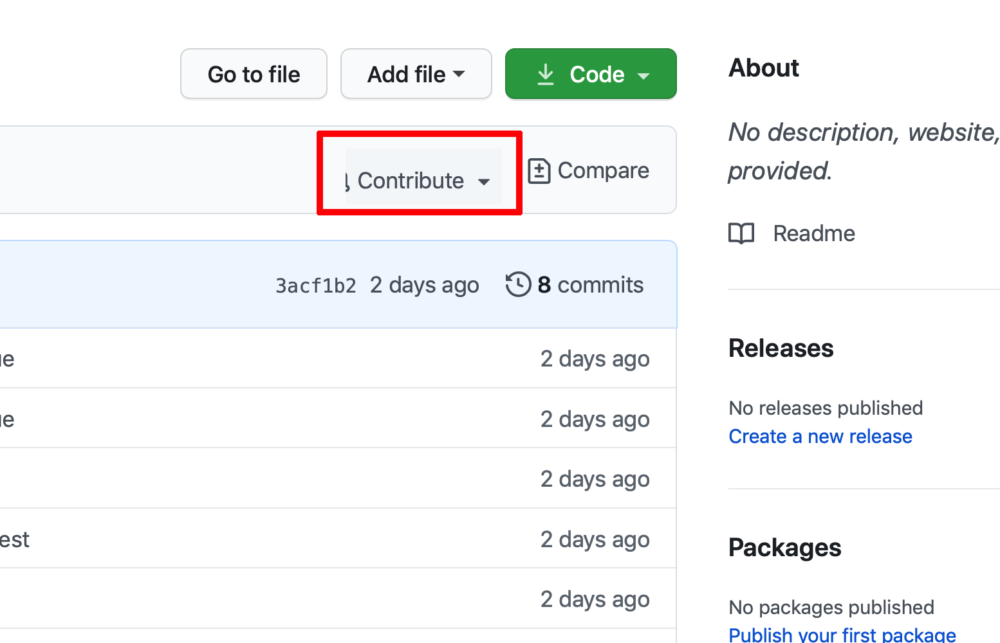

- убеждаемся, что номер ветки слева равен номеру ИНДИВИДУАЛЬНОЙ ветки! Справа ветка будет называться **main**

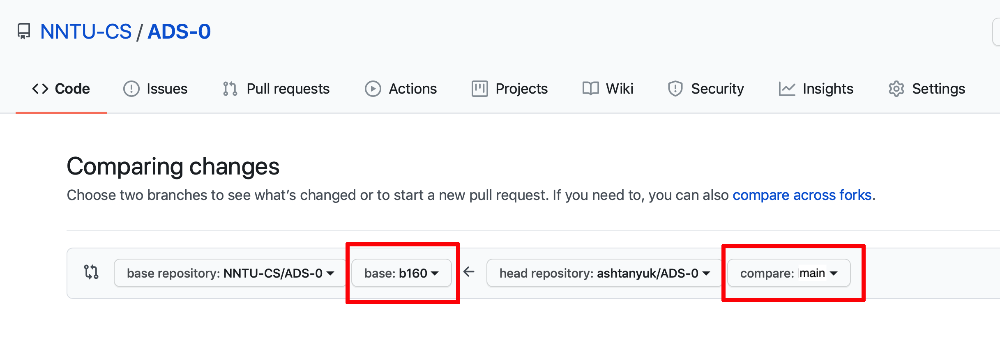

- Нажимаем  на зеленую кнопку **Open pull request**

Далее, в целевом репозитории создается очередь из пул-запросов на проверку. Для каждого запроса выполняется автоматическая процедура построения программы и тестирования. Успешное окончание тестирования сопровождается зеленой галочкой, неуспешное - красным крестиком. Работа засчитывается, если она успешно прошла тестирование.

- посмотреть список пул-запросов, отправленных на проверку можно в меню **Pull requests**
- посмотреть результаты проверки своего пул-запроса можно в меню **Actions**

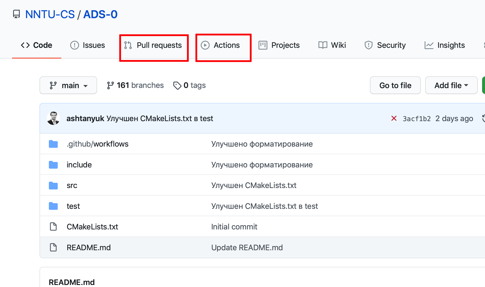

- чтобы посмотреть ошибки, нужно зайти в **Actions**

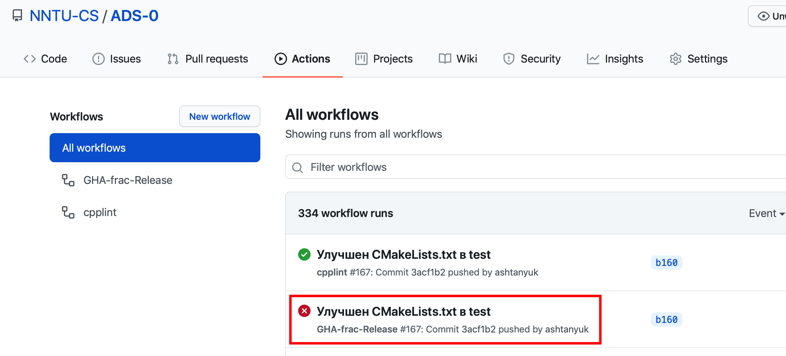

- далее, выбираем пункт с ошибкой

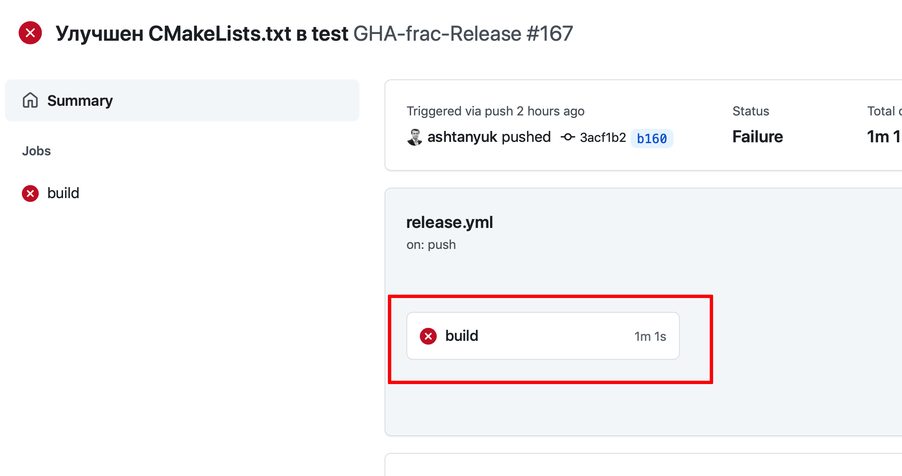

- разкрываем лог и находим описание ошибки

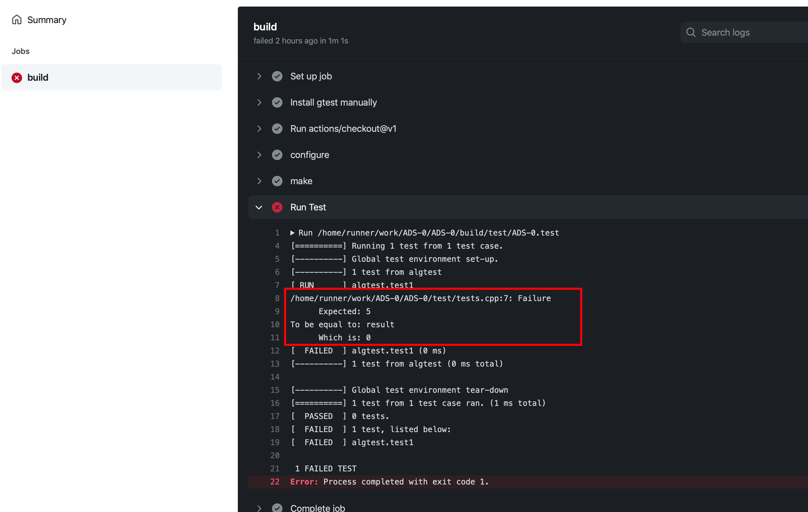

- для того, чтобы устранить ошибку, нужно в своем аккаунте исправить файл **alg.cpp**, пул-запрос обновится автоматически

