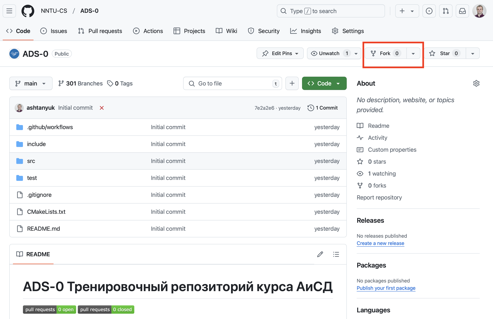

# Инструкция о выполнении заданий на сайте **GitHub**

Для начала работы необходимо создать бесплатный аккаунт на сайте **github.com**.

## Алгоритм выполнения практической работы

- После входа в систему (*Sign in*) переходим на страницу организации *https://github.com/NNTU-CS*

- Выбираем репозиторий с практическим заданием (в примере **ADS-0**)

- Нажимаем кнопку **Fork** в правом верхнем углу окна
- Начинается процесс копирования репозитория в аккаунт пользователя

- После окончания копирования мы возвращаемся в свой аккаунт (вместо **ashtanyuk** будет ваше имя пользователя)

- в выпадающем списке выбираем свою **индивидуальную** ветку (в примере **b160**)

- Переходим в каталог **src**

- Выбираем в списке имя файла **alg.cpp**

- входим в режим редактирования файла

- вставляем реализацию алгоритма в тело функции

- Нажимаем внизу на зеленую кнопку **Commit**

- Нажимаем справа на надпись **Pull Request**

- убеждаемся, что номера веток слева и справа совпадают

- Нажимаем  на зеленую кнопку **Create pull request**

Далее, в целевом репозитории создается очередь из пул-запросов на проверку. Для каждого запроса выполняется автоматическая процедура построения программы и тестирования. Успешное окончание тестирования сопровождается зеленой галочкой, неуспешное - красным крестиком. Работа засчитывается, если она успешно прошла тестирование.

- посмотреть список пул-запросов, отправленных на проверку можно в меню **Pull requests**
- посмотреть результаты проверки своего пул-запроса можно в меню **Actions**

- чтобы посмотреть ошибки, нужно зайти в **Actions**

- далее, выбираем пункт с ошибкой

- разкрываем лог и находим описание ошибки

- для того, чтобы устранить ошибку, нужно в своем аккаунте исправить файл **alg.cpp**, пул-запрос обновится автоматически

